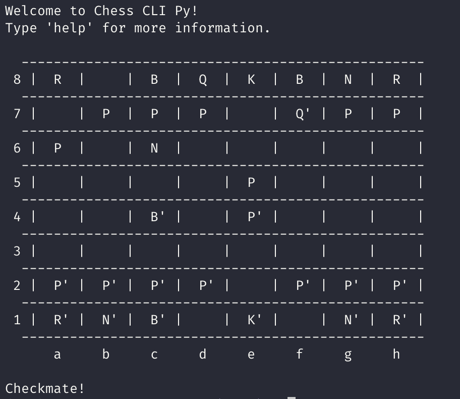

# Chess in your CLI!

Play chess in your CLI. This is a simple chess game that you can play in your terminal. It is written in Python and does not require any external libraries. Just clone the repository and run the `chess.py` script.

I wrote this game during my free time to kill boredom.

## How to play

- Clone the repository.
- Run the `chess.py` script using Python 3.
- Play the game! The game will prompt you for moves. Enter moves in algebraic notation (e.g. `e4`, `Nf3`, `Bb5`).

## Improvements

- [ ] Implement en passant.
- [ ] Implement a simple AI.
- [ ] Use Unicode characters for the pieces.
- [ ] Improve the CLI interface. Maybe use a library like `curses` to draw the board, etc.
- [ ] Add more tests.

## Contributing

Although this is just a toy project, all contributions are more than welcome. Feel free to open an issue or a pull request.
